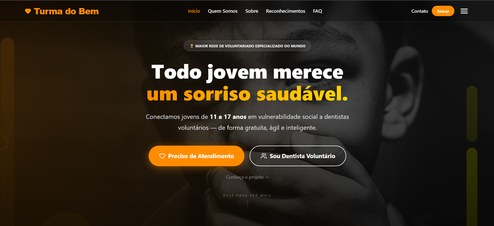

# 🦷 Turma do Bem — Otimizando o Atendimento, Transformando Vidas


---

##  Título e Descrição

**Turma do Bem (TdB)** é a maior rede de voluntariado odontológico do mundo. Este projeto entrega uma plataforma web SPA que conecta jovens em situação de vulnerabilidade social a dentistas voluntários, com um algoritmo de **Score TdB** que prioriza os casos mais graves e otimiza o fluxo de triagem, adoção e atendimento.

A aplicação foi desenvolvida em **React + Vite + TypeScript** com integração à API REST Java (Quarkus/Spring) hospedada no Azure, conforme exigido pela Sprint 4 do Challenge FIAP × Turma do Bem.

---

##  Como Usar (Links do Projeto)

| Recurso | Link |
|---|---|
|  **Aplicação online (Vercel)** | https://challenge-sprint-rose.vercel.app/ |
|  **Repositório GitHub (Front-End)** | https://github.com/gcorrea4/Challenge-Sprint |
|  **Vídeo de apresentação (YouTube)** | `[ADICIONAR LINK]` |
|  **API Java (Azure)** | https://challengesprint-api.azurewebsites.net |

### Executar localmente

**Pré-requisito:** [Node.js](https://nodejs.org/) 18+ instalado.

```bash
# 1. Clone o repositório
git clone https://github.com/gcorrea4/Challenge-Sprint.git
cd Challenge-Sprint

# 2. Instale as dependências
npm install

# 3. (Opcional) Configure a URL da API para desenvolvimento local
# Crie um arquivo .env.local na raiz com:
# VITE_API_URL=http://localhost:8080
# Sem esse arquivo, a aplicação aponta para a API em produção (Azure).

# 4. Inicie o servidor de desenvolvimento
npm run dev

# 5. Abra http://localhost:5173/ no navegador
```

### Scripts disponíveis

```bash
npm run dev         # servidor de desenvolvimento (Vite)
npm run build       # build de produção (tsc + vite build)
npm run preview     # preview do build local
npm run lint        # ESLint
npm run typecheck   # checagem de tipos sem emitir
npm run test        # testes unitários (Vitest)
npm run check       # tsc + eslint + vitest (pipeline completa)
```

---

##  Tecnologias Utilizadas

| Categoria | Tecnologia |
|---|---|
| **Framework** | React 19 + Vite 8 |
| **Linguagem** | TypeScript 5.9 (tipagem estática rigorosa) |
| **Estilização** | Tailwind CSS 4 (sem CSS externo) |
| **Roteamento** | React Router DOM 7 (SPA com rotas estáticas e dinâmicas) |
| **Formulários** | React Hook Form 7 (validação nativa) |
| **Animações** | Framer Motion 12 |
| **Mapas** | Leaflet + React-Leaflet + Leaflet.Heat |
| **Ícones** | Lucide React |
| **Geração de PDF/CSV** | jsPDF + jsPDF-AutoTable |
| **Integração com API** | Fetch API nativa (sem Axios) |
| **Testes** | Vitest + Testing Library |
| **Linting** | ESLint 9 + typescript-eslint |
| **Deploy** | Vercel |
| **Versionamento** | Git + GitHub |

---

##  Funcionalidades Implementadas

-  **Autenticação por perfil** — admin, dentista e paciente, com `ProtectedRoute` centralizado validando sessão e role antes de renderizar cada dashboard.
-  **Cadastro de pacientes** com integração ViaCEP (preenchimento automático de endereço) e validação completa via React Hook Form.
-  **Triagem com cálculo de Score TdB** — algoritmo que prioriza pacientes por urgência clínica e vulnerabilidade social.
-  **Mapa interativo (Leaflet)** com heatmap de pacientes por cidade e cálculo de rota até o dentista.
-  **Dashboard Admin** com exportação de relatórios em PDF e CSV.
-  **Dashboard Dentista** — fila priorizada, adoção de pacientes, conclusão de atendimento e visualização geográfica.
-  **Dashboard Paciente** — acompanhamento de status e prontuário individual.
-  **Prontuário dinâmico** via rota com parâmetro (`/prontuario/:nome`).
-  **Dark mode** com hook `useDarkMode`.
-  **Layout 100% responsivo** — Mobile (até 480px), Tablet (768px) e Desktop (992px+).

---

##  Estrutura de Pastas do Projeto

```text
Challenge-Sprint/
├── public/                       # Assets estáticos servidos diretamente
├── scripts/                      # Scripts utilitários (geração de coordenadas LATAM)
├── src/
│   ├── components/               # Componentes reutilizáveis
│   │   ├── ui/                   # Design system (Button, Card, Input, Badge, etc.)
│   │   ├── Header.tsx            # Cabeçalho com navegação
│   │   ├── Footer.tsx            # Rodapé
│   │   ├── ProtectedRoute.tsx    # Guard de rotas autenticadas
│   │   ├── MapaRota.tsx          # Mapa com Leaflet e cálculo de rota
│   │   ├── ModalAvaliarPaciente.tsx
│   │   ├── ModalFichaAtiva.tsx
│   │   └── StatusAgendamento.tsx
│   ├── pages/                    # Views (uma por rota)
│   │   ├── Home.tsx
│   │   ├── Sobre.tsx
│   │   ├── QuemSomos.tsx         # Página de Integrantes
│   │   ├── FAQ.tsx
│   │   ├── Contato.tsx
│   │   ├── Reconhecimentos.tsx
│   │   ├── Login.tsx
│   │   ├── Cadastro.tsx
│   │   ├── Formulario.tsx        # Triagem
│   │   ├── FormularioContato.tsx
│   │   ├── CalculadoraScore.tsx
│   │   ├── Doador.tsx
│   │   ├── Prontuario.tsx        # Rota dinâmica /prontuario/:nome
│   │   ├── AdminDashboard.tsx
│   │   ├── DentistaDashboard.tsx
│   │   └── PacienteDashboard.tsx
│   ├── Routes/
│   │   └── index.tsx             # Configuração central de rotas (BrowserRouter)
│   ├── hooks/
│   │   ├── useCep.ts             # Hook de integração com ViaCEP
│   │   └── useDarkMode.ts        # Toggle de tema
│   ├── utils/
│   │   ├── api.ts                # Wrapper de fetch (apiFetch) com header Authorization
│   │   ├── scoreUtils.ts         # Algoritmo do Score TdB
│   │   ├── relatorioUtils.ts     # Geração de PDF (jsPDF)
│   │   └── adminExportUtils.ts   # Exportação CSV
│   ├── data/                     # Dados estáticos (cidades, coordenadas LATAM)
│   ├── img/                      # Imagens da equipe e do sistema
│   ├── test/                     # Testes unitários (Vitest)
│   ├── config.ts                 # URL base da API (lê VITE_API_URL)
│   ├── App.tsx                   # Componente raiz
│   ├── main.tsx                  # Ponto de entrada do React
│   └── stl.css                   # Diretivas Tailwind
├── eslint.config.js
├── index.html
├── package.json
├── tsconfig.json
├── vercel.json                   # Rewrites SPA para Vercel
├── vite.config.ts
└── vitest.config.ts
```

---

## 🔌 Integração com a API (Back-End Java/DDD)

A aplicação consome a API REST desenvolvida na disciplina **Domain Driven Design Using Java**, publicada no Azure. A URL base é resolvida em tempo de build pelo Vite via variável `VITE_API_URL` (com fallback para `https://challengesprint-api.azurewebsites.net`).

### Endpoints consumidos (CRUD completo)

| Verbo HTTP | Endpoint | Função |
|---|---|---|
| `POST` | `/login` | Autenticação de usuário |
| `POST` | `/pacientes` | Cadastro de paciente |
| `POST` | `/ofertas` | Adoção de paciente pelo dentista |
| `POST` | `/pacientes/redefinir-senha` | Redefinição de senha |
| `GET` | `/pacientes?cidade=...` | Lista pacientes por cidade |
| `GET` | `/pacientes/adotados?idDentista=...` | Lista pacientes adotados pelo dentista |
| `GET` | `/ofertas/dentista/:id` | Histórico de ofertas |
| `PUT` | `/pacientes/:id` | Atualização de dados |
| `PATCH` | `/ofertas/:id/concluir` | Conclusão de atendimento |
| `DELETE` | (via `apiFetch`) | Remoção de registros |

O wrapper `apiFetch` (em `src/utils/api.ts`) injeta automaticamente o header `Authorization: Bearer <token>` quando há sessão ativa.

---

##  Imagens e Screenshots


<!--  -->
<!--  -->

---

##  Autores e Créditos — Equipe 1TDSPB

| Foto | Nome | RM | Turma | GitHub | LinkedIn |
|:---:|---|:---:|:---:|:---:|:---:|
|  | **Gabriel Correa** | 567903 | 1TDSPB | [@gcorrea4](https://github.com/gcorrea4) | [LinkedIn](https://www.linkedin.com/in/gabriel-correa-souza-763135271/) |
|  | **Kayque Duarte** | 567980 | 1TDSPB | [@Kayque2012](https://github.com/Kayque2012) | [LinkedIn](https://www.linkedin.com/in/kayque-duarte-b24313361/) |
|  | **Eric Maciel** | 567398 | 1TDSPB | [@Eric-devops-tech](https://github.com/Eric-devops-tech) | [LinkedIn](https://www.linkedin.com/in/eric-maciel-144058389/) |

---

##  Contato

Para dúvidas, sugestões ou colaborações, entre em contato com a equipe através do LinkedIn ou GitHub dos integrantes listados acima, ou pelo formulário de contato disponível na própria aplicação (`/contato`).

---

##  Licença

Projeto acadêmico desenvolvido para o **Challenge FIAP × Turma do Bem — 1TDS Agosto 2025**. Uso educacional.