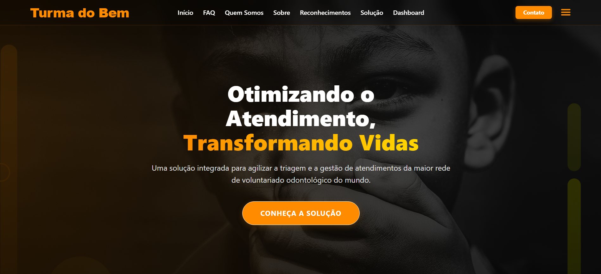
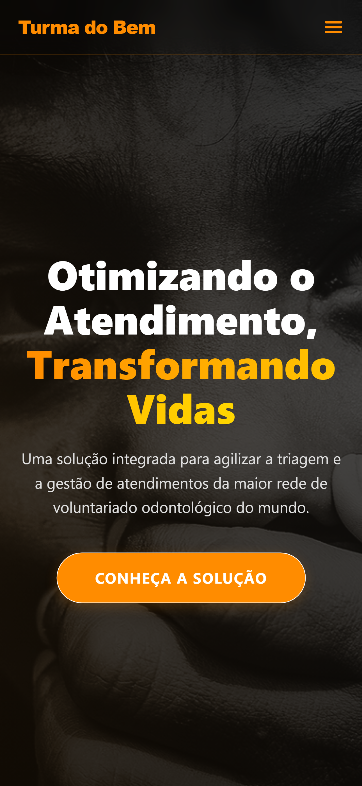

# 🦷 Challenge Turma do Bem - FIAP
Este é o protótipo Front-End desenvolvido para o Challenge da ONG Turma do Bem. O projeto visa otimizar a triagem e o atendimento de jovens em situação de vulnerabilidade social, conectando-os a dentistas voluntários através de uma plataforma web inteligente, rápida e acessível.
## 🚀 Tecnologias Utilizadas
* **React.js** com **Vite**
* **TypeScript**
* **Tailwind CSS** (Estilização e Responsividade Total)
* **React Router Dom** (Navegação SPA)
* **React Hook Form** (Validação de formulários)
## ⚙️ Funcionalidades Implementadas
* Layout 100% responsivo (Adaptável para Celulares, Tablets e Desktops).
* Navegação fluida entre páginas sem recarregamento (Single Page Application).
* Validação robusta de formulários.
* Páginas exclusivas demonstrando a solução tecnológica (Triagem via IA e Dashboard do Dentista Voluntário).
* Código limpo e componentizado.
## 🛠️ Como rodar o projeto na sua máquina
1. Certifique-se de ter o [Node.js](https://nodejs.org/) instalado.
2. Extraia os arquivos do projeto e abra a pasta no seu editor de código (ex: VS Code).
3. Abra o terminal na pasta raiz do projeto e instale as dependências executando:
  `npm install`
4. Após a instalação, inicie o servidor de desenvolvimento com o comando:
  `npm run dev`
5. Acesse o link gerado no terminal (geralmente `http://localhost:5173/`) no seu navegador.

## Screenshots

## 👥 Equipe de Desenvolvimento (Turma 1TDSPB)
* **Gabriel Correa** (RM: 567903) - [GitHub](https://github.com/gcorrea4) | [LinkedIn](https://www.linkedin.com/in/gabriel-correa-souza-763135271/)
* **Kayque Duarte** (RM: 567980) - [GitHub](https://github.com/Kayque2012) | [LinkedIn](https://www.linkedin.com/in/kayque-duarte-b24313361)
* **Eric Maciel** (RM: 567398) - [GitHub](https://github.com/Eric-devops-tech) | [LinkedIn](https://www.linkedin.com/in/eric-maciel-144058389)
